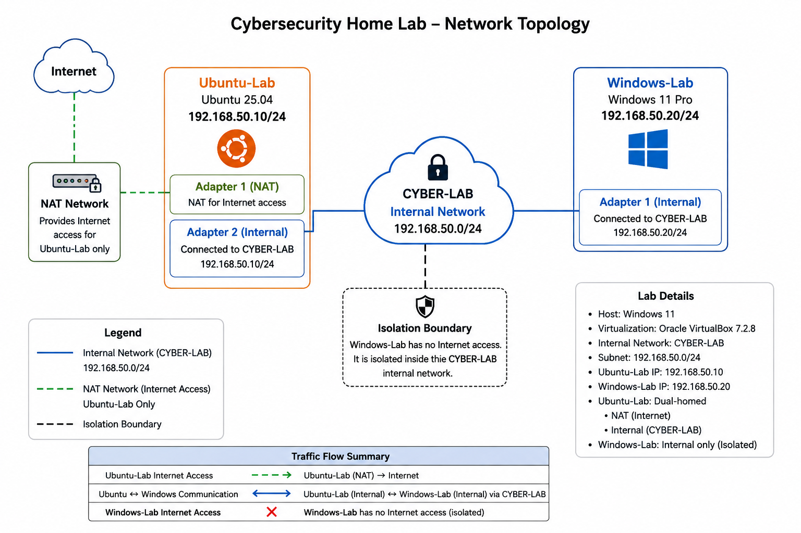

# cybersecurity-home-lab
Beginner cybersecurity home lab documenting networking, Windows/Linux administration, Nmap reconnaissance, firewall configuration, and security experiments.
# Cybersecurity Home Lab

## Overview

This repository documents my hands-on cybersecurity home lab built to develop practical skills in networking, Linux and Windows administration, network reconnaissance, firewall configuration, and security monitoring.

The lab provides an isolated environment where I can safely practice cybersecurity concepts using systems that I own and control.

## Lab Environment

### Host System

- Windows 11
- Oracle VirtualBox 7.2.8
- 16 GB RAM
- Virtualization enabled

### Ubuntu-Lab

- Ubuntu 25.04
- 4 GB RAM
- 2 CPUs
- 40 GB virtual disk
- Lab IP: `192.168.50.10/24`

Ubuntu-Lab has two virtual network interfaces:

- NAT interface for Internet access
- Internal Network interface connected to `CYBER-LAB`

Ubuntu-Lab is currently being used for Linux administration, network troubleshooting, and security tools such as Nmap.

### Windows-Lab

- Windows 11 Pro
- 4 GB RAM
- 2 CPUs
- 60 GB virtual disk
- Lab IP: `192.168.50.20/24`

Windows-Lab is connected only to the isolated `CYBER-LAB` network.

It is being used as a Windows endpoint for administration, firewall configuration, network analysis, and security testing.

## Network Architecture

The lab uses a VirtualBox Internal Network named:

`CYBER-LAB`

Lab subnet:

`192.168.50.0/24`

Current topology:

Ubuntu-Lab (`192.168.50.10`) <--> CYBER-LAB <--> Windows-Lab (`192.168.50.20`)

Ubuntu-Lab also has a separate NAT interface that provides Internet access.

Windows-Lab does not currently have Internet access and remains isolated inside the lab network.

## Skills Practiced So Far

- VirtualBox virtual machine configuration
- Linux and Windows installation
- IPv4 addressing
- Static IP configuration
- Network interface configuration
- Network troubleshooting
- ICMP connectivity testing
- Windows Defender Firewall configuration
- Linux networking commands
- Nmap host and port scanning
- Nmap service detection
- Nmap OS fingerprinting
- Basic SMB reconnaissance

## Current Project Status

The initial lab environment is operational.

Ubuntu-Lab and Windows-Lab can communicate across the isolated `CYBER-LAB` network.

I am currently using the environment to study how network services, ports, host firewalls, and reconnaissance tools interact.

## Next Steps

Planned additions include:

- Additional Nmap experiments
- Windows and Linux administration
- Active Directory
- Centralized logging
- SIEM monitoring
- Detection engineering
- Controlled attack-and-defense exercises
- PowerShell and Python automation
